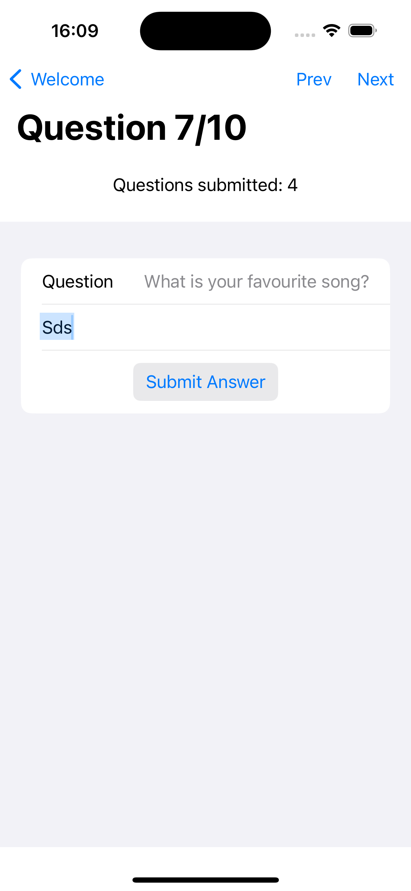
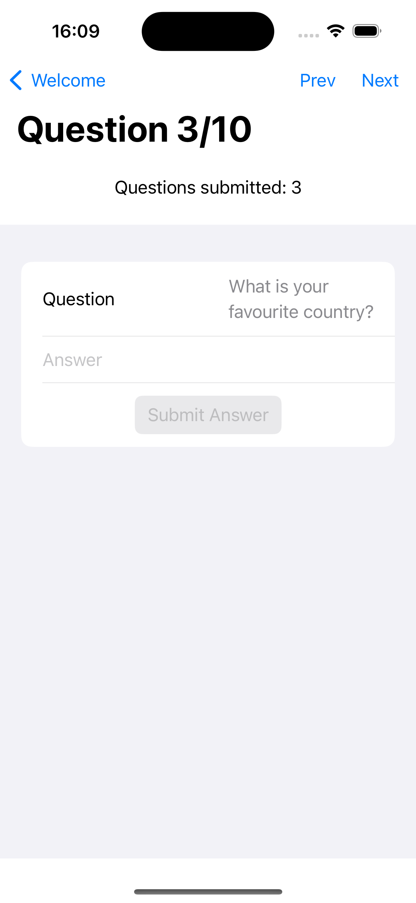

# XM Technical Challenge - iOS App (SwiftUI)

This is an iOS application built with Swift and SwiftUI, following the Composable Architecture ([TCA](https://github.com/pointfreeco/swift-composable-architecture)) pattern. The app is allows for user to answer and submit survey questions. Fore detailed information requirements, please check out this [Assignment Specification](Assets/AssignmentDetails.pdf)

## Features

- UI supports dynamic font + dynamic theme (dark + light)

The App contains a 2 screens, each with specific function:

- AppRoot: A welcome screen that allow the user to move forward to the question feed screen.
- QuestionFeed: This screen displays a list of the user's question and allow the user to move through each question, answer and submit.
- The user is alerted when they have submitted the answer successfully or not

Other packages including:

- ConfigConstant: A module that loads environment specific configs that is bundled with the app (through a plist), such as the APIBaseURl (for sandbox/production/etc.)
- APIClient: API Client that implements URL Requests for the provided APIs as documented in the [API Reference](Assets/AssignmentDetails.pdf). This package also define all API models and perform conversion to domain models defined in the Models package.
- Models: Package that contains domain models used in the app.
- Utils: Extensions and utilities that are useful throughout the app.

Each feature or screen is separated into its own Swift package, declared in the project's [Package](/Package.swift), making it easier to maintain, colaborate and extend the codebase.

## Screen shots/Videos:

Checkout the recorded video at [video](Assets/video.mp4)

|     |                |              |
| :--------------------------------------: | :-----------------------------------------------------: | :-----------------------------------------------------: |
|  |  |  |

## Architecture

### Considerations

Several architectural patterns were considered for this project.
Ultimately, the Composable Architecture (TCA) pattern was chosen for the following reasons:

- Separation of Concerns: TCA enforces a strict separation between state management, view rendering, and side effects (e.g., API calls, business logic operations).
- Testability: The architecture is designed with testability in mind, making it easy to write comprehensive unit tests for each component.
- Scalability: As the app grows, TCA's modular design makes it easier to maintain and extend the codebase.
- Familiarity: As an experienced Swift developer, I am already familiar with TCA, which minimizes the learning curve and allows me to deliver the project quickly and to a high standard.

Each feature or screen is separated into its own Swift package, making it easier to maintain and extend the codebase.

## Testing

Coverage: 96%

The project includes comprehensive unit tests to ensure the reliability and correctness of the codebase. The tests cover various aspects of the app, including data fetching, business logic, and user interface interactions.
For UI Layer, snapshot tests are added as well to make sure the UI is as per requirements.

## Getting Started

### Prerequisites

- iOS 17.0 or later
- macOS 13.0 or later

1. Clone the repository: git clone https://github.com/Kishimotovn/StarlingTechChallenge.git
2. Open the  in Xcode
3. Build and run the app on the desired simulator or device

## Dependencies

The app replies on

1. [TCA](https://github.com/pointfreeco/swift-composable-architecture): The composable architecture framework: provider utilities for easily compose and test features inside the app.
2. [SnapshotTesting](https://github.com/pointfreeco/swift-snapshot-testing): This library provide tool to perform snapshot testing on views.

The dependencies are managed using the Swift Package Manager and are included in the project.

## API Integration

The app integrates with the provided public API to fetch questions and submit answers in [API Reference](Assets/AssignmentDetails.pdf). The API calls are made using URLSession, and the responses are parsed and handled accordingly.

## Contributing

Contributions to this project are welcome. If you find any issues or have suggestions for improvements, please open an issue or submit a pull request.

## License

This project is licensed under the MIT License.
